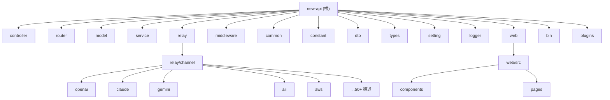

# New API - AI 上下文文档

> 本文档为 AI 辅助开发提供项目上下文，自动生成于 2025-12-28T20:58:40+0800

## 项目愿景

New API 是一个**新一代大模型网关与 AI 资产管理系统**，基于 [One API](https://github.com/songquanpeng/one-api) 进行二次开发。它提供了统一的 API 接口来访问多种 AI 服务提供商（OpenAI、Claude、Gemini、阿里、百度等 50+ 渠道），支持用户管理、配额计费、渠道管理、负载均衡和失败重试等企业级功能。

## 架构总览

```
+------------------+     +------------------+     +------------------+
|   Web Frontend   |     |   API Gateway    |     |   AI Providers   |
|   (React/Vite)   |<--->|   (Go/Gin)       |<--->|   (50+ 渠道)     |
+------------------+     +------------------+     +------------------+
                               |
                               v
                    +------------------+
                    |   Data Layer     |
                    | MySQL/PG/SQLite  |
                    |   + Redis        |
                    +------------------+
```

### 技术栈

| 层级 | 技术 |
|------|------|
| 后端框架 | Go 1.25+ / Gin |
| 前端框架 | React 18 / Vite / Semi UI |
| 数据库 | MySQL 5.7+ / PostgreSQL 9.6+ / SQLite |
| 缓存 | Redis (可选) |
| 容器化 | Docker / Docker Compose |

## 模块结构图



## 模块索引

| 模块路径 | 职责说明 | 主要技术 |
|----------|----------|----------|
| `controller/` | API 控制器层，处理 HTTP 请求和响应 | Go/Gin |
| `router/` | 路由定义，URL 映射到控制器 | Go/Gin |
| `model/` | 数据模型层，ORM 定义和数据库操作 | GORM |
| `service/` | 业务逻辑服务层 | Go |
| `relay/` | API 中继/代理核心，各渠道适配器 | Go |
| `relay/channel/` | 50+ AI 渠道适配器实现 | Go |
| `middleware/` | HTTP 中间件（认证、限流、日志等） | Go/Gin |
| `common/` | 公共工具函数和常量 | Go |
| `constant/` | 全局常量定义 | Go |
| `dto/` | 数据传输对象（请求/响应结构） | Go |
| `types/` | 类型定义 | Go |
| `setting/` | 配置管理（计费、限流、系统设置） | Go |
| `logger/` | 日志管理 | Go |
| `web/` | React 前端应用 | React/Vite/Semi UI |
| `plugins/` | VSCode 扩展插件（Augment 请求拦截） | JavaScript/VSCode API |
| `bin/` | 数据库迁移脚本 | SQL |

## 运行与开发

### 环境要求

- Go 1.25+
- Node.js 18+ / Bun (前端构建)
- Docker (可选，用于容器化部署)

### 快速启动

```bash
# 1. 克隆项目
git clone https://github.com/QuantumNous/new-api.git
cd new-api

# 2. 安装前端依赖并构建
cd web && bun install && bun run build && cd ..

# 3. 运行后端
go run main.go

# 4. 访问 http://localhost:3000
```

### Docker 部署

```bash
# 使用 Docker Compose
docker-compose up -d

# 或使用 Docker
docker run --name new-api -d --restart always \
  -p 3000:3000 \
  -e TZ=Asia/Shanghai \
  -v ./data:/data \
  calciumion/new-api:latest
```

### 关键环境变量

| 变量名 | 说明 | 默认值 |
|--------|------|--------|
| `SQL_DSN` | 数据库连接字符串 | SQLite |
| `REDIS_CONN_STRING` | Redis 连接字符串 | 无 |
| `SESSION_SECRET` | 会话密钥（多机部署必须） | 随机 |
| `CRYPTO_SECRET` | 加密密钥（Redis 必须） | 无 |
| `PORT` | 服务端口 | 3000 |
| `GIN_MODE` | Gin 模式 (debug/release) | release |

## 测试策略

- 项目目前没有自动化测试文件（`*_test.go`）
- 建议添加单元测试和集成测试
- 可使用 `go test ./...` 运行测试

## 编码规范

### Go 代码规范

1. **包命名**：使用小写字母，避免下划线
2. **文件命名**：使用小写字母和下划线（如 `channel_cache.go`）
3. **错误处理**：使用 `error` 类型，及时返回错误
4. **日志**：使用 `common.SysLog()` 和 `common.SysError()` 记录日志

### 渠道适配器开发模式

新增 AI 渠道需要：
1. 在 `constant/channel.go` 添加渠道类型常量
2. 在 `relay/channel/` 下创建渠道目录
3. 实现 `Adaptor` 接口（见 `relay/channel/adapter.go`）
4. 在渠道工厂中注册适配器

### 前端代码规范

1. **组件**：使用函数式组件和 Hooks
2. **UI 库**：使用 Semi UI 组件
3. **格式化**：使用 Prettier（单引号，无分号）
4. **国际化**：使用 i18next

## AI 使用指引

### 推荐操作

1. **添加新渠道**：参考现有渠道实现（如 `relay/channel/openai/`）
2. **修改 API 路由**：查看 `router/` 目录
3. **修改数据模型**：查看 `model/` 目录，注意数据库迁移
4. **前端修改**：查看 `web/src/` 目录

### 注意事项

1. **数据库迁移**：修改模型后需更新 `migrateDB()` 函数
2. **渠道密钥**：敏感信息存储在数据库，注意安全
3. **流式响应**：使用 SSE，注意 `STREAMING_TIMEOUT` 配置
4. **Redis 缓存**：启用时需设置 `CRYPTO_SECRET`

### 关键文件

| 文件 | 说明 |
|------|------|
| `main.go` | 应用入口，初始化和启动 |
| `router/api-router.go` | API 路由定义 |
| `router/relay-router.go` | 中继路由（AI API 代理） |
| `relay/channel/adapter.go` | 渠道适配器接口定义 |
| `model/main.go` | 数据库初始化和迁移 |
| `constant/channel.go` | 渠道类型定义 |

## 变更记录 (Changelog)

| 时间 | 操作 | 说明 |
|------|------|------|
| 2025-12-28T20:58:40+0800 | 初始化 | 首次生成 AI 上下文文档 |
