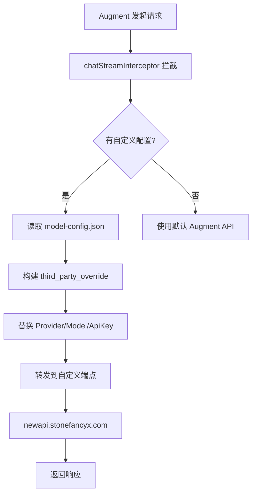

[根目录](../../CLAUDE.md) > [plugins](../CLAUDE.md) > **extension**

# Augment Extension - 请求拦截与自定义代理插件

> 修改版 Augment VSCode 扩展，实现 AI API 请求拦截并使用自定义 API Key、Provider 和模型进行代理请求。

## 模块概述

本模块是一个经过修改的 Augment VSCode 扩展插件，核心功能：

- **请求拦截**：通过 `chatStreamInterceptor` 全局对象拦截原生 API 请求
- **第三方覆盖**：使用 `third_party_override` 机制替换默认配置
- **自定义代理**：将请求转发到自定义 API 端点（默认 `http://localhost:90`）
- **配置持久化**：配置存储在 `~/.augment/model-config.json`

## 文件清单与职责

| 文件 | 大小 | 职责 |
|------|------|------|
| `out/extension.js` | ~13MB | **核心逻辑** - 扩展主入口，包含请求拦截、配置管理、API 调用 |
| `out/custom-panel.html` | ~1500行 | **配置面板** - WebView 配置界面，用于设置 API Key 和模型 |
| `common-webviews/` | - | **公共资源** - WebView 使用的 CSS、JS、字体资源 |

## 核心机制

### 1. 请求拦截 (chatStreamInterceptor)

```javascript
// 全局拦截器对象
global.chatStreamInterceptor = {
    localServiceConfig: {
        targetModel: "kiro-claude-opus-4-5-agentic",
        provider: "Kiro",
        apiKey: "sk-xxx",
        baseUrl: "http://localhost:90"
    }
};
```

### 2. 第三方覆盖机制 (third_party_override)

```javascript
// 请求构建时的覆盖逻辑
third_party_override: (() => {
    let override = config.chat.override;
    if (!override) return;
    let result = {};
    if (override.providerModelName?.trim()) {
        result.providerModelName = override.providerModelName.trim();
    }
    if (override.apiKey?.trim()) {
        result.apiKey = override.apiKey.trim();
    }
    if (override.baseUrl?.trim()) {
        result.baseUrl = override.baseUrl.trim();
    }
    return result.providerModelName || result.apiKey || result.baseUrl
        ? serialize(result)
        : undefined;
})()
```

### 3. 配置存储

**配置文件路径**：`~/.augment/model-config.json`

```javascript
const configPath = path.join(os.homedir(), ".augment", "model-config.json");
```

**配置结构**：

```json
{
    "provider": "Kiro",
    "model": "kiro-claude-opus-4-5-agentic",
    "base_url": "http://localhost:90",
    "api_key": "sk-xxx"
}
```

## 预置配置

### 硬编码 Provider

```javascript
const DEFAULT_PROVIDER = 'Kiro';
const DEFAULT_BASE_URL = 'http://localhost:90';
```

### 支持的模型列表

| 显示名称 | 实际模型名称 |
|---------|-------------|
| Claude Opus 4.5 | `kiro-claude-opus-4-5-agentic` |
| Sonnet 4.5 | `kiro-claude-sonnet-4-5-agentic` |
| Sonnet 4 | `kiro-claude-sonnet-4-agentic` |
| Haiku 4.5 | `kiro-claude-haiku-4-5-agentic` |

```javascript
const KIRO_MODELS = [
    'kiro-claude-opus-4-5-agentic',
    'kiro-claude-sonnet-4-5-agentic',
    'kiro-claude-sonnet-4-agentic',
    'kiro-claude-haiku-4-5-agentic'
];
```

## 配置面板功能

### WebView 消息通信

**前端 → 后端**：

| 命令 | 说明 |
|------|------|
| `saveModelConfig` | 保存模型配置 |
| `getModelConfig` | 获取当前配置 |
| `refreshQuotaInfo` | 刷新套餐信息 |
| `getExtensionInfo` | 获取扩展信息 |
| `getActivationStatus` | 获取激活状态 |
| `activateSystem` | 激活系统 |

**后端 → 前端**：

| 命令 | 说明 |
|------|------|
| `modelConfigLoaded` | 配置加载完成 |
| `modelConfigSaved` | 配置保存结果 |
| `quotaInfoLoaded` | 套餐信息加载完成 |
| `extensionInfo` | 扩展信息 |
| `activationStatus` | 激活状态 |

### 套餐信息 API

**请求端点**：

```javascript
{
    hostname: "newapi.stonefancyx.com",
    path: "/api/usage/token/",
    method: "GET",
    headers: {
        Authorization: `Bearer ${apiKey}`
    }
}
```

**响应结构**：

```json
{
    "success": true,
    "data": {
        "total_available": 100000,
        "expires_at": 1735488000
    }
}
```

## 请求处理流程



## 配置面板界面

### UI 结构

```
┌─────────────────────────────────────┐
│ 🤖 模型配置                    [刷新] │
├─────────────────────────────────────┤
│ API Key: [sk-xxx...     ] [👁️]     │
│ 选择模型: [Claude Opus 4.5    ▼]    │
│                                     │
│ [应用配置]                          │
│ ✅ 模型配置已保存                    │
├─────────────────────────────────────┤
│ 💳 套餐信息                    [刷新] │
├─────────────────────────────────────┤
│ 当前余额: 1000                      │
│ 过期时间: 2025-12-31 23:59:59       │
└─────────────────────────────────────┘
```

### 隐藏的 UI 元素

以下元素在界面中被隐藏（硬编码默认值）：

- Header 标题区域
- Provider 选择器（固定为 Kiro）
- Base URL 输入框（固定为默认 API）
- 激活卡片
- Token 配置卡片

## 关键函数

### extension.js 核心函数

```javascript
// 保存模型配置
function handleSaveModelConfig(config) {
    const configPath = path.join(os.homedir(), ".augment", "model-config.json");
    fs.writeFileSync(configPath, JSON.stringify(config, null, 2));
    // 更新全局拦截器
    global.chatStreamInterceptor.localServiceConfig.targetModel = config.model;
    global.chatStreamInterceptor.localServiceConfig.provider = config.provider;
    global.chatStreamInterceptor.localServiceConfig.apiKey = config.api_key || "sk-dummy";
}

// 获取 API Key
function getApiKeyFromConfig() {
    const configPath = path.join(os.homedir(), ".augment", "model-config.json");
    if (fs.existsSync(configPath)) {
        const config = JSON.parse(fs.readFileSync(configPath, "utf8"));
        return config.api_key;
    }
    return null;
}

// 获取套餐信息
function fetchQuotaInfo(apiKey) {
    const options = {
        hostname: "newapi.stonefancyx.com",
        path: "/api/usage/token/",
        method: "GET",
        headers: { Authorization: `Bearer ${apiKey}` }
    };
    // ... HTTP 请求
}
```

### custom-panel.html 核心函数

```javascript
// 应用模型配置
function applyModelConfig() {
    const config = {
        provider: DEFAULT_PROVIDER,        // "Kiro"
        model: selectedModel,              // 用户选择的模型
        base_url: DEFAULT_BASE_URL,        // 固定端点
        api_key: apiKey                    // 用户输入的 API Key
    };
    vscode.postMessage({ command: 'saveModelConfig', config: config });
}

// 刷新套餐信息
function refreshQuotaInfo() {
    vscode.postMessage({ command: 'refreshQuotaInfo' });
}

// 更新套餐显示
function updateQuotaDisplay(quotaInfo) {
    const available = Math.floor(quotaInfo.data.total_available / 100);
    document.getElementById('quota-available').textContent = `${available}`;
}
```

## 技术实现细节

### Monaco Editor 集成

配置面板使用 CDN 加载 Monaco Editor：

```javascript
const MONACO_VERSION = "0.52.2";
const MONACO_CDN_BASE = `https://cdnjs.cloudflare.com/ajax/libs/monaco-editor/${MONACO_VERSION}/min`;
```

### CSP 安全策略

使用 nonce 保护内联脚本：

```html
<script nonce="nonce-HKpiL9ffRsG6GgQ9TWd7rQ==">
    // 脚本内容
</script>
```

### VSCode API 通信

```javascript
const vscode = acquireVsCodeApi();

// 发送消息到扩展
vscode.postMessage({ command: 'getModelConfig' });

// 接收扩展消息
window.addEventListener('message', event => {
    const message = event.data;
    switch (message.command) {
        case 'modelConfigLoaded':
            updateModelConfigDisplay(message.config);
            break;
        // ...
    }
});
```

## 与 new-api 的关系

本插件是 new-api 项目的客户端组件：

1. **new-api** 作为 API 网关，提供多渠道 AI API 代理
2. **Augment 插件** 拦截请求，将其转发到 new-api
3. **API Key** 用于 new-api 的用户认证和配额管理

```
┌──────────────────┐     ┌─────────────────┐     ┌────────────────┐
│   Augment IDE    │────▶│    new-api      │────▶│  Claude API    │
│   (VSCode)       │     │  API Gateway    │     │  OpenAI API    │
│                  │     │                 │     │  Gemini API    │
│  ┌────────────┐  │     │ /v1/chat/...    │     │     ...        │
│  │ Extension  │──┼────▶│                 │     │                │
│  │ Plugin     │  │     │ 渠道路由        │     │                │
│  └────────────┘  │     │ 格式转换        │     │                │
└──────────────────┘     │ 配额管理        │     └────────────────┘
                         └─────────────────┘
```

## 依赖关系

| 依赖 | 用途 |
|------|------|
| `os` | 获取用户主目录 |
| `path` | 路径处理 |
| `fs` | 配置文件读写 |
| `https` | API 请求 |
| `vscode` | VSCode 扩展 API |
| `keytar` | 安全存储（node_modules） |

## 变更记录 (Changelog)

| 时间 | 操作 | 说明 |
|------|------|------|
| 2025-12-28 | 创建 | 首次生成模块文档 |
