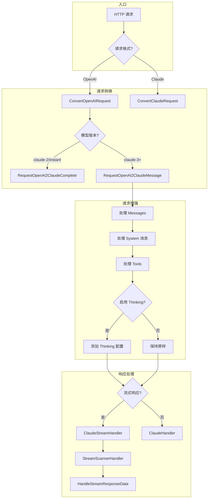

[根目录](../../../CLAUDE.md) > [relay](../../CLAUDE.md) > [channel](../CLAUDE.md) > **claude**

# Claude 渠道适配器模块

> Anthropic Claude API 的完整适配实现，支持 Messages API 和 Completions API，包含 Thinking 模式、Tool Use、Web Search 等高级功能。

## 模块概述

本模块实现了 Claude API 的代理转发功能，主要特性：

- **双模式支持**：同时支持 Claude Messages API（v3+）和旧版 Completions API（v2）
- **格式转换**：OpenAI 格式 ⇄ Claude 格式双向转换
- **流式处理**：完整的 SSE 流式响应支持
- **高级功能**：Extended Thinking、Tool Use、Web Search

## 文件清单与职责

| 文件 | 行数 | 职责说明 |
|------|------|----------|
| `adaptor.go` | 134 | **适配器核心**：实现 `Adaptor` 接口，协调请求/响应处理 |
| `relay-claude.go` | 861 | **中继逻辑**：请求转换、响应处理、流式传输的核心实现 |
| `constants.go` | 30 | **常量定义**：支持的模型列表、渠道名称 |
| `dto.go` | 96 | **类型定义**（已注释）：历史类型定义，已迁移至 `dto/claude.go` |

## 核心类型定义

### 适配器结构 (adaptor.go)

```go
const (
    RequestModeCompletion = 1  // Claude v2 Completions API
    RequestModeMessage    = 2  // Claude v3+ Messages API
)

type Adaptor struct {
    RequestMode int  // 根据模型自动选择 API 模式
}
```

### 响应信息结构 (relay-claude.go)

```go
type ClaudeResponseInfo struct {
    ResponseId   string           // 响应 ID
    Created      int64            // 创建时间戳
    Model        string           // 使用的模型
    ResponseText strings.Builder  // 累积响应文本
    Usage        *dto.Usage       // Token 使用统计
    Done         bool             // 流式响应完成标记
}
```

## 支持的模型列表

```go
var ModelList = []string{
    // Legacy 模型 (使用 Completions API)
    "claude-instant-1.2",
    "claude-2", "claude-2.0", "claude-2.1",

    // Claude 3 系列 (使用 Messages API)
    "claude-3-sonnet-20240229",
    "claude-3-opus-20240229",
    "claude-3-haiku-20240307",
    "claude-3-5-haiku-20241022",
    "claude-haiku-4-5-20251001",
    "claude-3-5-sonnet-20240620",
    "claude-3-5-sonnet-20241022",
    "claude-3-7-sonnet-20250219",

    // Thinking 模型 (启用 Extended Thinking)
    "claude-3-7-sonnet-20250219-thinking",
    "claude-sonnet-4-20250514",
    "claude-sonnet-4-20250514-thinking",
    "claude-opus-4-20250514",
    "claude-opus-4-20250514-thinking",
    "claude-opus-4-1-20250805",
    "claude-opus-4-1-20250805-thinking",
    "claude-sonnet-4-5-20250929",
    "claude-sonnet-4-5-20250929-thinking",
    "claude-opus-4-5-20251101",
    "claude-opus-4-5-20251101-thinking",
}
```

## 关键函数签名

### 适配器方法 (adaptor.go)

```go
// 初始化：根据模型名自动选择 API 模式
func (a *Adaptor) Init(info *relaycommon.RelayInfo)

// 获取请求 URL
func (a *Adaptor) GetRequestURL(info *relaycommon.RelayInfo) (string, error)
// → Messages API: {baseUrl}/v1/messages
// → Completions API: {baseUrl}/v1/complete

// 设置请求头
func (a *Adaptor) SetupRequestHeader(c *gin.Context, req *http.Header, info *relaycommon.RelayInfo) error
// 设置: x-api-key, anthropic-version, anthropic-beta

// OpenAI 请求转换为 Claude 请求
func (a *Adaptor) ConvertOpenAIRequest(c *gin.Context, info *relaycommon.RelayInfo, request *dto.GeneralOpenAIRequest) (any, error)

// 执行响应处理
func (a *Adaptor) DoResponse(c *gin.Context, resp *http.Response, info *relaycommon.RelayInfo) (usage any, err *types.NewAPIError)
```

### 请求转换函数 (relay-claude.go)

```go
// OpenAI → Claude Completions API (旧版)
func RequestOpenAI2ClaudeComplete(textRequest dto.GeneralOpenAIRequest) *dto.ClaudeRequest

// OpenAI → Claude Messages API (新版)
func RequestOpenAI2ClaudeMessage(c *gin.Context, textRequest dto.GeneralOpenAIRequest) (*dto.ClaudeRequest, error)
```

### 响应转换函数 (relay-claude.go)

```go
// Claude → OpenAI 流式响应
func StreamResponseClaude2OpenAI(reqMode int, claudeResponse *dto.ClaudeResponse) *dto.ChatCompletionsStreamResponse

// Claude → OpenAI 非流式响应
func ResponseClaude2OpenAI(reqMode int, claudeResponse *dto.ClaudeResponse) *dto.OpenAITextResponse

// stop_reason 映射
func stopReasonClaude2OpenAI(reason string) string
// → "stop_sequence" / "end_turn" → "stop"
// → "max_tokens" → "length"
// → "tool_use" → "tool_calls"
```

## 请求处理流程



## Claude 特有功能说明

### 1. Extended Thinking (扩展思考)

**触发方式**：
- 模型名以 `-thinking` 结尾
- 设置 `reasoning_effort` 参数
- 设置 `reasoning.max_tokens` 参数

**处理逻辑**：
```go
if strings.HasSuffix(textRequest.Model, "-thinking") {
    claudeRequest.Thinking = &dto.Thinking{
        Type:         "enabled",
        BudgetTokens: int(float64(MaxTokens) * 0.8), // 默认 80%
    }
    // 必须设置 temperature = 1.0, top_p = 0
    claudeRequest.Temperature = 1.0
    claudeRequest.TopP = 0
}
```

**Reasoning Effort 映射**：

| OpenAI reasoning_effort | Claude budget_tokens |
|------------------------|---------------------|
| "low" | 1280 |
| "medium" | 2048 |
| "high" | 4096 |

### 2. Tool Use (工具调用)

**支持的工具类型**：
- 标准 Function 工具
- Web Search 工具 (`web_search_20250305`)

**转换逻辑**：
```go
// OpenAI Function → Claude Tool
claudeTool := dto.Tool{
    Name:        tool.Function.Name,
    Description: tool.Function.Description,
    InputSchema: params,
}
```

### 3. Web Search Tool

**参数映射**：
```go
// search_context_size → max_uses
switch SearchContextSize {
case "low":    MaxUses = 1
case "medium": MaxUses = 5
case "high":   MaxUses = 10
}
```

### 4. 流式事件类型

| Claude 事件类型 | 说明 | OpenAI 映射 |
|----------------|------|-------------|
| `message_start` | 消息开始 | 初始化响应 |
| `content_block_start` | 内容块开始 | text/tool_use 开始 |
| `content_block_delta` | 内容块增量 | 文本/thinking/tool 增量 |
| `message_delta` | 消息增量 | finish_reason |
| `message_stop` | 消息结束 | 忽略 |

### 5. Delta 类型处理

| Delta Type | 处理方式 |
|------------|----------|
| `text` | 映射到 `content` |
| `thinking_delta` | 映射到 `reasoning_content` |
| `signature_delta` | 忽略（加密签名） |
| `input_json_delta` | 映射到 `tool_calls[].function.arguments` |

## 依赖关系

| 模块 | 路径 | 用途 |
|------|------|------|
| dto | `github.com/QuantumNous/new-api/dto` | 请求/响应数据结构 |
| common | `github.com/QuantumNous/new-api/common` | 通用工具函数 |
| types | `github.com/QuantumNous/new-api/types` | 类型定义 |
| logger | `github.com/QuantumNous/new-api/logger` | 日志记录 |
| model_setting | `github.com/QuantumNous/new-api/setting/model_setting` | Claude 配置 |
| relaycommon | `github.com/QuantumNous/new-api/relay/common` | 中继公共工具 |
| helper | `github.com/QuantumNous/new-api/relay/helper` | 流式处理辅助 |

## 配置项

### Claude 设置 (setting/model_setting/claude.go)

```go
type ClaudeSettings struct {
    // 模型特定请求头
    HeadersSettings map[string]map[string][]string

    // 默认 max_tokens
    DefaultMaxTokens map[string]int  // 默认: {"default": 8192}

    // Thinking 适配器开关
    ThinkingAdapterEnabled bool  // 默认: true

    // Thinking budget_tokens 占 max_tokens 的比例
    ThinkingAdapterBudgetTokensPercentage float64  // 默认: 0.8
}
```

## 使用示例

### 作为 OpenAI 兼容 API

```bash
curl -X POST http://localhost:3000/v1/chat/completions \
  -H "Authorization: Bearer sk-xxx" \
  -H "Content-Type: application/json" \
  -d '{
    "model": "claude-3-5-sonnet-20241022",
    "messages": [{"role": "user", "content": "Hello!"}],
    "stream": true
  }'
```

### 直接 Claude 格式

```bash
curl -X POST http://localhost:3000/v1/messages \
  -H "x-api-key: sk-xxx" \
  -H "anthropic-version: 2023-06-01" \
  -H "Content-Type: application/json" \
  -d '{
    "model": "claude-3-5-sonnet-20241022",
    "max_tokens": 1024,
    "messages": [{"role": "user", "content": "Hello!"}]
  }'
```

### 启用 Thinking 模式

```bash
curl -X POST http://localhost:3000/v1/chat/completions \
  -H "Authorization: Bearer sk-xxx" \
  -d '{
    "model": "claude-3-7-sonnet-20250219-thinking",
    "messages": [{"role": "user", "content": "复杂推理问题..."}],
    "max_tokens": 16000
  }'
```

## 变更记录 (Changelog)

| 时间 | 操作 | 说明 |
|------|------|------|
| 2025-12-28 | 初始化 | 首次生成模块文档 |
