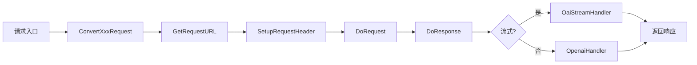

[根目录](../../../CLAUDE.md) > [relay](../../CLAUDE.md) > [channel](../CLAUDE.md) > openai

# OpenAI 渠道适配器

> 核心适配器模块，处理 OpenAI 及兼容 API 的请求转发。

## 模块概述

OpenAI 适配器是 relay 系统的核心组件，负责：
- OpenAI Chat/Completions API 请求转发
- Azure OpenAI 服务支持
- 流式/非流式响应处理
- 多格式输出（OpenAI/Claude/Gemini）
- 音频 TTS/STT 处理
- 实时 WebSocket API 支持
- Responses API（新版）支持

## 文件清单

| 文件 | 行数 | 职责 |
|------|------|------|
| `adaptor.go` | ~650 | **入口文件** - Adaptor 接口实现，请求转换与路由 |
| `relay-openai.go` | ~640 | 响应处理器（流式/非流式/WebSocket） |
| `helper.go` | ~260 | 流式格式转换辅助函数 |
| `audio.go` | ~145 | TTS/STT 音频处理 |
| `relay_responses.go` | ~150 | Responses API 处理 |
| `constant.go` | ~48 | 模型列表和渠道名称 |

## 核心类型定义

```go
// adaptor.go - 适配器结构体
type Adaptor struct {
    ChannelType    int     // 渠道类型（OpenAI/Azure/OpenRouter等）
    ResponseFormat string  // 音频响应格式
}
```

## 支持的模型

```go
var ModelList = []string{
    // GPT-3.5 系列
    "gpt-3.5-turbo", "gpt-3.5-turbo-0613", "gpt-3.5-turbo-1106", ...
    // GPT-4 系列
    "gpt-4", "gpt-4-turbo", "gpt-4o", "gpt-4o-mini", ...
    // GPT-4.5/5 系列
    "gpt-4.5-preview", "gpt-5", "gpt-5-mini", ...
    // O系列推理模型
    "o1", "o1-mini", "o1-pro", "o3", "o3-mini", "o4-mini", ...
    // 实时音频模型
    "gpt-4o-realtime-preview", "gpt-4o-audio-preview", ...
    // Embedding
    "text-embedding-ada-002", "text-embedding-3-small", ...
    // 图像生成
    "dall-e-3", "gpt-image-1",
    // 音频处理
    "whisper-1", "tts-1", "tts-1-hd", ...
}
```

## 核心接口

```go
// 主要方法
func (a *Adaptor) Init(info *relaycommon.RelayInfo)
func (a *Adaptor) GetRequestURL(info *relaycommon.RelayInfo) (string, error)
func (a *Adaptor) SetupRequestHeader(c *gin.Context, header *http.Header, info *relaycommon.RelayInfo) error
func (a *Adaptor) ConvertOpenAIRequest(c *gin.Context, info *relaycommon.RelayInfo, request *dto.GeneralOpenAIRequest) (any, error)
func (a *Adaptor) ConvertClaudeRequest(c *gin.Context, info *relaycommon.RelayInfo, request *dto.ClaudeRequest) (any, error)
func (a *Adaptor) ConvertGeminiRequest(c *gin.Context, info *relaycommon.RelayInfo, request *dto.GeminiChatRequest) (any, error)
func (a *Adaptor) DoRequest(c *gin.Context, info *relaycommon.RelayInfo, requestBody io.Reader) (any, error)
func (a *Adaptor) DoResponse(c *gin.Context, resp *http.Response, info *relaycommon.RelayInfo) (usage any, err *types.NewAPIError)
```

## 请求处理流程



## 响应处理函数

```go
// 流式响应处理
func OaiStreamHandler(c *gin.Context, info *relaycommon.RelayInfo, resp *http.Response) (*dto.Usage, *types.NewAPIError)

// 非流式响应处理
func OpenaiHandler(c *gin.Context, info *relaycommon.RelayInfo, resp *http.Response) (*dto.Usage, *types.NewAPIError)

// 实时WebSocket处理
func OpenaiRealtimeHandler(c *gin.Context, info *relaycommon.RelayInfo) (*types.NewAPIError, *dto.RealtimeUsage)

// 音频处理
func OpenaiTTSHandler(c *gin.Context, resp *http.Response, info *relaycommon.RelayInfo) *dto.Usage
func OpenaiSTTHandler(c *gin.Context, resp *http.Response, info *relaycommon.RelayInfo, responseFormat string) (*types.NewAPIError, *dto.Usage)
```

## 特殊功能

### 1. O系列模型推理强度后缀

```go
// 支持 -high, -low, -medium, -minimal, -none, -xhigh 后缀
// 例如: "o3-mini-high" → effort="high", model="o3-mini"
func parseReasoningEffortFromModelSuffix(model string) (string, string)
```

### 2. Thinking-to-Content 转换

支持将模型的 `reasoning_content` 转换为普通 `content`，使用 `<think>` 标签包裹。

### 3. 多格式输出

支持将 OpenAI 响应转换为 Claude 或 Gemini 格式：
- `ResponseOpenAI2Claude()`
- `ResponseOpenAI2Gemini()`

## 依赖关系

```
relay/channel/openai/
    ├── → relay/common/           # RelayInfo, ThinkingContentInfo
    ├── → relay/helper/           # 流式处理辅助函数
    ├── → dto/                    # 请求/响应数据结构
    ├── → types/                  # 错误类型定义
    ├── → service/                # 业务逻辑服务
    └── → constant/               # 渠道类型常量
```

## 配置项

| 配置项 | 说明 |
|--------|------|
| `ChannelSetting.ForceFormat` | 强制格式化响应 |
| `ChannelSetting.ThinkingToContent` | 将推理内容转换为普通内容 |
| `info.IsStream` | 是否流式请求 |
| `info.RelayFormat` | 输出格式（OpenAI/Claude/Gemini） |

## 变更记录

| 时间 | 操作 | 说明 |
|------|------|------|
| 2025-12-28 | 初始化 | 模块文档生成 |
